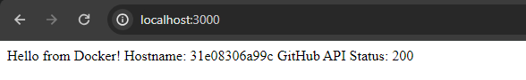

# - Avoir une application fonctionnelle sur le port de votre choix et le montrer à votre formatteur

Après avoir ajouté le fichier `Dockerfile` et le fichier `docker-compose.yml`, il nous suffit de lancer la commande `docker-compose build` suivit de `docker-compose up` pour lancer le projet.
Le projet est accessible sur le port 3000 de localhost.

# - Le Dockerfile devra être versionné sur Github. Renseigner l'url sur votre rapport

https://github.com/AlzUrt/docker